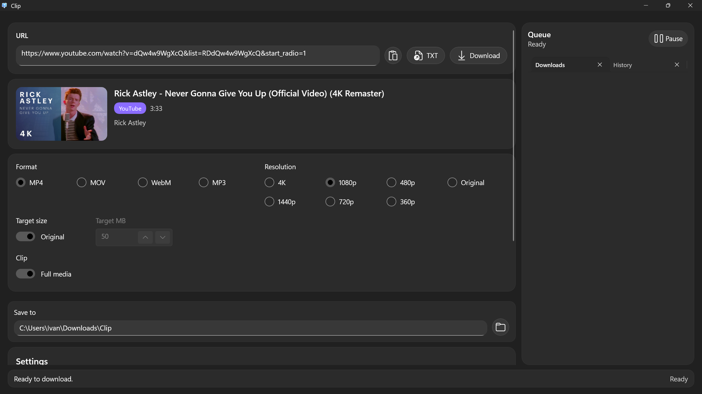
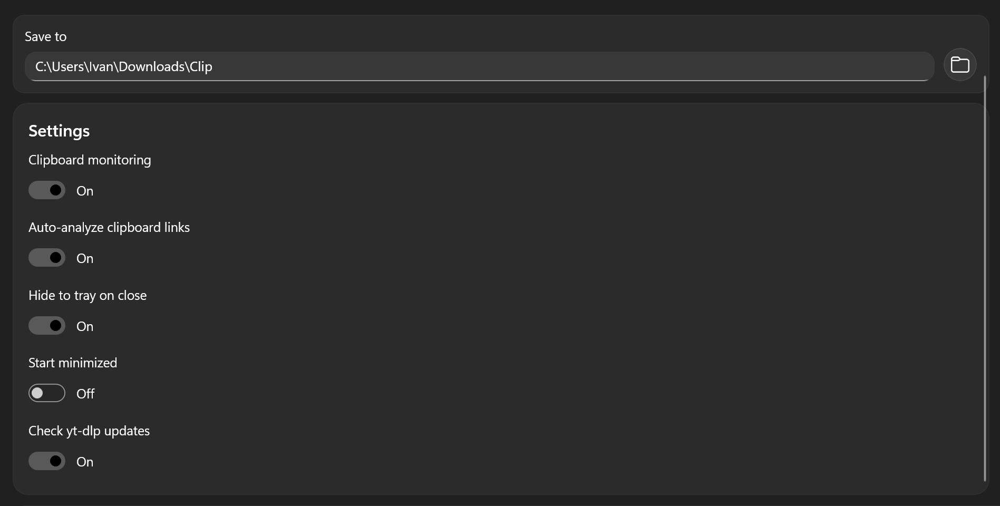
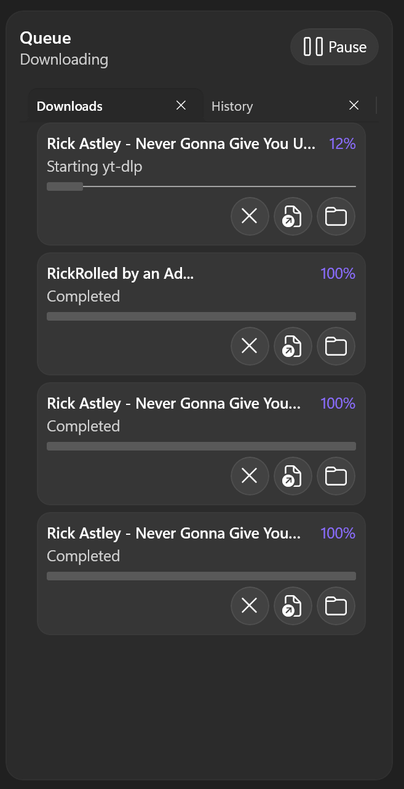

# Clip

<p align="center">
  
</p>

<p align="center">
  
  
  
  
  
</p>

Clip - cross-platform desktop downloader and media processing toolkit powered by `yt-dlp`, `ffmpeg`, and `ffprobe`.

## Table of contents

* [Description](#description)
* [Features](#features)
  * [Downloader](#downloader)
  * [Queue Manager](#queue-manager)
  * [Video Processing](#video-processing)
  * [Metadata Cache](#metadata-cache)
  * [Tool Resolver](#tool-resolver)
  * [Desktop UI](#desktop-ui)
* [What's new in current migration](#whats-new-in-current-migration)
* [System Requirements](#system-requirements)
* [Project Structure](#project-structure)
* [External Tools](#external-tools)
* [Build](#build)
* [Publish](#publish)
* [Windows Installer](#windows-installer)
* [macOS Packaging](#macos-packaging)
* [Local Data](#local-data)
* [Limitations](#limitations)
* [To do](#to-do)
* [Distribution](#distribution)
* [DOWNLOAD](#download)
* [Licensing](#licensing)
* [Creators](#creators)
* [Contacts](#contacts)

## Description

> Clip downloads video and audio from supported links, analyzes metadata through `yt-dlp`, stores reusable metadata JSON, queues downloads, and runs `ffmpeg`/`ffprobe` for trim, muxing, compression, and media inspection. The project is being migrated from a Windows-only WinUI app to a cross-platform .NET architecture with Avalonia UI for Windows and macOS.

The existing WinUI project is still kept for Windows compatibility during the transition. The new cross-platform entry point is `src/Clip.App`.

## Features

### Downloader

* Single URL downloads.
* Video + audio, audio-only, and video-only modes.
* Format choices: `MP4`, `MOV`, `WebM`, `MP3`, `Original`, `Best`.
* Resolution choices: `Original`, `4K`, `2160p`, `1440p`, `1080p`, `720p`, `480p`, `360p`.
* TXT import with empty-line filtering, duplicate removal, and basic URL validation.
* Batch download command support through `yt-dlp -a links.txt` when settings are uniform.
* `yt-dlp --concurrent-fragments` support.
* Experimental `aria2c` mode prepared for HTTP downloads.
* Safe argument passing through `ProcessStartInfo.ArgumentList`.

### Queue Manager

* Separate queue limit for metadata analysis.
* Separate queue limit for downloads.
* Serialized `ffmpeg` queue for post-processing.
* Task cancellation through `CancellationToken`.
* Task states: `Pending`, `Analyzing`, `Ready`, `Downloading`, `PostProcessing`, `Completed`, `Failed`, `Cancelled`.
* History records for completed tasks.

### Video Processing

* Fast trim through stream copy:

```bash
ffmpeg -ss START -to END -i input.mp4 -c copy output.mp4
```

* Exact trim with re-encode.
* Compression presets: fast, balance, quality.
* Hardware encoder detection through `ffmpeg -encoders`.
* Windows encoder options: NVIDIA, Intel, AMD.
* macOS encoder options: Apple VideoToolbox.

### Metadata Cache

* One URL analysis can be stored as one metadata JSON file.
* Cache key includes normalized URL, yt-dlp version, and analysis options.
* SHA256 file names for safe cache storage.
* TTL support.
* Cache invalidation when yt-dlp version changes.

### Tool Resolver

* Platform detection through `RuntimeInformation`.
* Windows x64 tool folder support.
* macOS Intel tool folder support.
* macOS Apple Silicon tool folder support.
* Fallback to legacy runtime folders.
* Fallback to `PATH`.
* macOS executable permission check and best-effort `chmod +x`.

### Desktop UI

* Existing WinUI app remains available under `Clip/`.
* New Avalonia app is under `src/Clip.App`.
* UI talks to shared view models from `Clip.Core`.
* File dialogs are isolated behind interfaces.
* Tray and clipboard behavior are isolated behind interfaces.

## What's new in current migration

### Cross-platform app structure

* `src/Clip.Core` contains shared application logic.
* `src/Clip.Platform` contains Windows/macOS service implementations.
* `src/Clip.App` contains the Avalonia desktop shell.
* Root `resources/bin` contains platform-specific tool folders.
* GitHub Actions builds Windows and macOS zip artifacts.

### Screenshots







## System Requirements

* .NET 8 SDK for development.
* Windows 10/11 x64 for the existing WinUI app and Windows Avalonia builds.
* macOS Intel or Apple Silicon for macOS validation and packaging.
* `yt-dlp`.
* `ffmpeg`.
* `ffprobe`.
* Optional: `aria2c`.

Supported publish runtimes:

```text
win-x64
osx-x64
osx-arm64
```

## Project Structure

```text
src/
  Clip.Core/
    Models/
    Services/
    ViewModels/
    DownloadQueue/
    History/
    Settings/
    Tools/
  Clip.App/
    App.axaml
    MainWindow.axaml
    Platform/
    Themes/
  Clip.Platform/
    Windows/
    MacOS/
resources/
  bin/
    win-x64/
    macos-arm64/
    macos-x64/
scripts/
  publish-windows.ps1
  publish-macos.sh
```

`Clip.Core` is platform-neutral. It must not reference WinUI, Avalonia, Windows-only APIs, macOS-only APIs, native dialogs, clipboard APIs, or tray APIs directly.

`Clip.Platform` owns platform implementations for paths, cookie source detection, tray, clipboard, and future native services.

`Clip.App` is the Avalonia UI layer.

## External Tools

Bundled tools should be placed in:

```text
resources/bin/win-x64/yt-dlp.exe
resources/bin/win-x64/ffmpeg.exe
resources/bin/win-x64/ffprobe.exe

resources/bin/macos-arm64/yt-dlp
resources/bin/macos-arm64/ffmpeg
resources/bin/macos-arm64/ffprobe

resources/bin/macos-x64/yt-dlp
resources/bin/macos-x64/ffmpeg
resources/bin/macos-x64/ffprobe
```

Optional `aria2c` binaries can be placed in the same platform folders.

Tool lookup order:

1. `Resources/bin/<platform>/` next to the app.
2. Legacy runtime folders such as `Resources/bin/osx-arm64/`.
3. `Resources/bin/`.
4. The app directory.
5. `PATH`.

On macOS, Clip attempts to set executable permission for bundled tools. If Gatekeeper blocks a downloaded binary, remove quarantine after verifying the file source:

```zsh
xattr -dr com.apple.quarantine yt-dlp ffmpeg ffprobe
chmod +x yt-dlp ffmpeg ffprobe
```

## Build

Restore dependencies:

```bash
dotnet restore
```

Build the solution:

```bash
dotnet build
```

Build only the cross-platform Avalonia app:

```bash
dotnet build src/Clip.App/Clip.App.csproj
```

Run the Avalonia app:

```bash
dotnet run --project src/Clip.App/Clip.App.csproj
```

Run tests:

```bash
dotnet run --project Clip.Tests/Clip.Tests.csproj
```

If NuGet tries to read a user-level configuration that is unavailable in a restricted shell, use:

```bash
dotnet restore --configfile NuGet.Config
```

## Publish

Windows Avalonia build:

```powershell
.\scripts\publish-windows.ps1
```

Manual Windows publish:

```bash
dotnet publish src/Clip.App/Clip.App.csproj -c Release -r win-x64 --self-contained true -o artifacts/Clip-win-x64
```

macOS builds:

```bash
./scripts/publish-macos.sh
```

Manual macOS publish:

```bash
dotnet publish src/Clip.App/Clip.App.csproj -c Release -r osx-arm64 --self-contained true -o artifacts/Clip-macos-arm64
dotnet publish src/Clip.App/Clip.App.csproj -c Release -r osx-x64 --self-contained true -o artifacts/Clip-macos-x64
```

## Windows Installer

The existing installer script still targets the legacy WinUI project:

```powershell
.\scripts\build-installer.ps1
```

Output:

```text
artifacts\ClipSetup.exe
```

If publishing fails because `yt-dlp.exe` is locked, close running Clip instances and retry. The publish scripts also fall back to a timestamped output folder when the previous artifact directory cannot be removed.

## macOS Packaging

The current macOS publish path produces a self-contained output folder. A production release should package that output as a `.app` bundle, then sign and notarize it.

Typical release steps:

1. Publish `osx-arm64` and `osx-x64`.
2. Copy the published files into `Clip.app/Contents/MacOS/`.
3. Place bundled tools under `Clip.app/Contents/MacOS/Resources/bin/macos-arm64/` or `Clip.app/Contents/MacOS/Resources/bin/macos-x64/`.
4. Ensure tool permissions with `chmod +x`.
5. Add `Info.plist`.
6. Sign the app bundle.
7. Create a `.dmg`.
8. Submit the `.dmg` for notarization.
9. Staple the notarization ticket.

Example commands:

```zsh
codesign --deep --force --options runtime --sign "Developer ID Application: Your Name" Clip.app
hdiutil create -volname "Clip" -srcfolder Clip.app -ov -format UDZO Clip.dmg
xcrun notarytool submit Clip.dmg --keychain-profile "notary-profile" --wait
xcrun stapler staple Clip.dmg
```

Unsigned development builds can be run locally, but public macOS releases should be signed and notarized to avoid Gatekeeper warnings.

## Local Data

Windows:

```text
Settings:       %LOCALAPPDATA%\Clip\settings.json
History:        %LOCALAPPDATA%\Clip\history.json
Metadata cache: %LOCALAPPDATA%\Clip\cache\metadata
Logs:           %LOCALAPPDATA%\Clip\logs\clip.log
Downloads:      %USERPROFILE%\Downloads\Clip
```

macOS:

```text
Settings:       ~/Library/Application Support/Clip/settings.json
History:        ~/Library/Application Support/Clip/history.json
Metadata cache: ~/Library/Application Support/Clip/cache/metadata
Logs:           ~/Library/Logs/Clip/clip.log
Downloads:      ~/Downloads/Clip
```

## Limitations

* The Avalonia app is a staged migration shell, not yet a full one-to-one replacement for every WinUI interaction.
* Native tray and continuous clipboard monitoring are currently interface-backed placeholders in the cross-platform path.
* macOS `.app`, `.dmg`, signing, and notarization require manual validation on macOS.
* External binaries are not committed to git.
* Some sites require browser cookies or may be restricted by the source platform.

## To do

* Complete native Windows and macOS tray implementations.
* Complete native clipboard monitor implementations.
* Add macOS `.app` bundle generation.
* Add macOS `.dmg` packaging script.
* Add signing and notarization automation.
* Expand Avalonia views into dedicated controls: `URLInput`, `VideoPreview`, `DownloadList`, `HistoryView`, `SettingsView`.
* Add full UI parity tests against the legacy WinUI workflow.

## Distribution

| File | Description |
| --- | --- |
| `Clip.App.exe` | Avalonia Windows executable. |
| `Clip.App` | Avalonia macOS executable inside the published output. |
| `Resources/bin/<platform>/yt-dlp` | yt-dlp binary for the target platform. |
| `Resources/bin/<platform>/ffmpeg` | ffmpeg binary for the target platform. |
| `Resources/bin/<platform>/ffprobe` | ffprobe binary for the target platform. |
| `Resources/bin/<platform>/aria2c` | Optional aria2c binary. |
| `README.md` | Main documentation. |
| `NuGet.Config` | Repository-local NuGet source configuration. |

## DOWNLOAD

Release artifacts are expected under GitHub Releases:

* https://github.com/Chychyndr/clip/releases

Tagged releases trigger `.github/workflows/build.yml` and produce:

```text
Clip-win-x64.zip
Clip-macos-arm64.zip
Clip-macos-x64.zip
```

## Licensing

No `LICENSE` file is currently present in this repository. Add one before public binary distribution.

## Creators

### Clip

* Chychyndr - project owner and maintainer.
* Contributors - future fixes, platform work, packaging, and UI migration.

## Contacts

Use GitHub Issues for bugs, feature requests, and release packaging questions:

* https://github.com/Chychyndr/clip/issues
